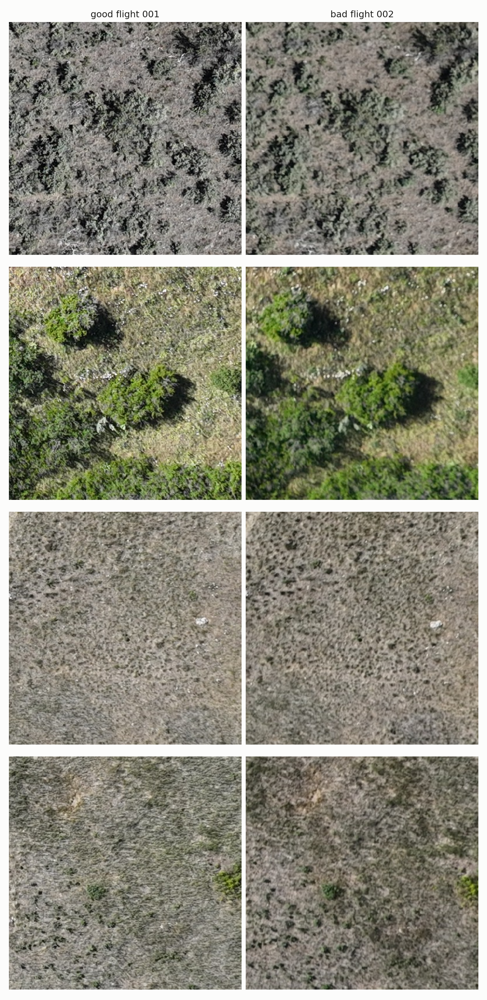
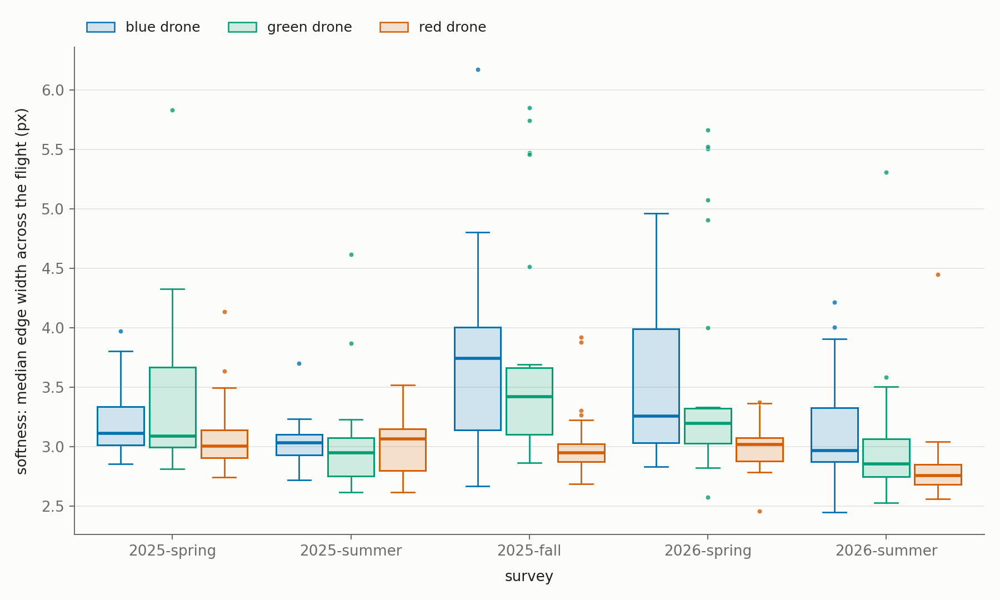
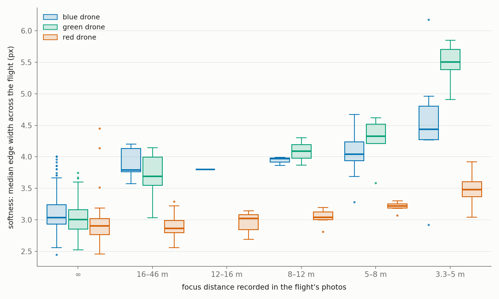

# M3M blur audit

During the MPG Ranch Front Country surveys we conducted 391 flights with three separate drones during spring, summer and fall 2025, and spring and summer 2026. We've discovered that some drones are prone to producing blurred/soft images, though this depends on season and camera focus settings. Each drone is identified by the serial number recorded in its photos, not by the folder it was filed under: eight
of the blue drone's fall 2025 flights were filed under M3M-red (see
[the notes at the end](#notes-for-erik-drone-serials-vs-folder-colors)).

## Blurriness happens flight by flight

Blur doesn't come and go from photo to photo. A whole flight is either sharp or soft, and 62 of the 391 flights were
soft. Several things point to the flight as the unit:

- **The camera sets its focus once per flight.** In all but 8 flights, every photo records the same focus distance, and
  the first photo already has it.
- **The whole frame softens, not one spot.** So it isn't a smudge or dust on the lens.
- **It's the camera, not the scene.** Next to a sharp flight's photo of the same ground, a soft photo keeps only about a
  quarter of the fine detail.
- **It switches at battery swaps.** Softness switched 54 times across 311 swaps. At 46 of those switches, the recorded
  focus changed too.

Mission 19 (blue drone, 22 June 2026) shows this well. Flight 001 was focused at infinity and came out sharp. After
the battery swap, flight 002 was focused at 5.1 m and was soft from its first photo. Each row shows the same patch of
ground from both flights. In the top row, the left photo is the last one flight 001 took before the drone came down for
a battery swap. The right photo is the first one flight 002 took when the mission resumed, over the same spot about
three minutes later.



## How the issue was first raised

This was first raised in a February
2023 DJI forum thread, [Mavic 3 Enterprise Manual Focus Auto-Adjusting](https://forum.dji.com/thread-285824-1-1.html).
There, pilots report manual focus that changes on its own; one calls it "more like a semi random automatic focus." In
one case, focus set on the treetops was moved to the ground mid-mission, blurring the trees. Our case differs a little.
Our focus rarely changes mid-flight. Instead, a close focus is set before the survey starts and stays for the whole
flight.

## Drone, year and season



Soft flights / flights:

| Drone | 2025 spring | 2025 summer | 2025 fall | 2026 spring | 2026 summer | All |
|---|---|---|---|---|---|---|
| Blue | 3/21 | 1/25 | 17/31 | 12/33 | 4/27 | 37/137 (27 %) |
| Green | 6/25 | 2/24 | 5/24 | 6/26 | 1/33 | 20/132 (15 %) |
| Red | 2/28 | 0/25 | 2/24 | 0/20 | 1/25 | 5/122 (4 %) |

Red rarely produces a soft flight. Blue and green were at their worst in fall 2025 and spring 2026. Blue is the only
drone that got worse from 2025 to 2026: comparing spring and summer, its odds of a soft flight rose about 3.6-fold.
Flights that start later in the day are less often soft, even once sunlight and temperature are accounted for.

## Focus distance



Every photo records the camera's focus distance. At 120 m, infinity is what we want. The closer the focus, the softer
the flight:

| Focus recorded | Flights | Soft |
|---|---|---|
| ∞ | 276 | 14 (5 %) |
| 16–46 m | 39 | 6 (15 %) |
| 12–16 m | 12 | 1 (8 %) |
| 8–12 m | 11 | 5 (45 %) |
| 5–8 m | 23 | 14 (61 %) |
| 3.3–5 m | 30 | 22 (73 %) |

Blue and green are hit hardest. Nearly every flight they fly focused closer than 12 m is soft (88 % and 94 %). Red's
usually aren't (14 %), even though red flies at a finite focus more often than the others. The pattern holds when we
compare a drone's flights from the same day. It also matches what the lens optics predict for each focus distance.

## Practice: set manual focus to infinity before the survey starts

By the first survey photo, the drone is already at altitude, pointing straight down and hovering, and its focus is
already set. So the close focus comes from before the mission starts: takeoff, the climb, or flying manually near the
ground. What we recommend:

1. At survey height, before starting the mission, switch the camera to manual focus (MF) and set it to infinity (∞).
2. Do the same before resuming after every battery swap.

Blue sometimes goes soft even at infinity (11 of 107 flights), so this won't fix everything on blue.

**Is firmware current, and the same on every drone?** The photos record the camera firmware:

| | 2025, all seasons | 2026 spring | 2026 summer |
|---|---|---|---|
| Blue | 11.08.02.02 | 11.09.03.02 | 11.09.03.02 |
| Green | 11.08.02.02 | 11.09.03.02 | 11.09.10.58 |
| Red | 11.08.02.02 | 11.09.03.02 | 11.09.03.02 |

Blue and red have run the same firmware all along, yet blue flies soft far more often, so firmware alone doesn't
explain it. It's still worth checking that the aircraft, camera and controller are current on all three drones. It's
also worth asking why green was ahead in summer 2026. The DJI release notes we reviewed don't mention focus.

**Check the controller firmware too.** We can't recover it from the images. Nothing in the photos or flight files
records the controller's firmware or the DJI Pilot 2 version. But the focus is set from the controller, so its firmware
may have some bearing on how manual focus behaves. For each controller, record the controller and Pilot 2 versions
from Pilot 2's About page, and note which drone it usually flies.

## Open question: replace parts on blue and green?

Red copes with a close focus; blue and green don't, which points to their cameras. Could Advexure, who service our
drones, replace the camera, or the module that controls focus, on blue and green? Replacing the camera sensor may not
help. The fault could sit in a deeper control module that stays with the aircraft. Worth asking Advexure:

- Can they bench-test whether focus holds at infinity?
- Is the focus drive part of the replaceable camera, or part of the aircraft?

## The sunlight sensor and reflectance differ too

The sunlight sensor on top of each drone should read the same light when two drones fly at the same time. Red's reads
9–26 % higher than blue's and green's, depending on band, and the gap was the same in both years:

| Band | Red ÷ blue | Red ÷ green |
|---|---|---|
| Green | 1.26 | 1.24 |
| Red | 1.20 | 1.18 |
| Red edge | 1.14 | 1.12 |
| NIR | 1.12 | 1.09 |

That carries into the multispectral data. When two drones photograph the same ground, their raw digital numbers match,
because each camera sets its own exposure. The calibration then divides by the sunlight sensor's reading. After it, red's
reflectance comes out about 15 % lower than blue's and green's, by nearly the same amount in every band:

| Band | Red ÷ blue | Red ÷ green | Blue ÷ green |
|---|---|---|---|
| Green | 0.86 | 0.82 | 1.00 |
| Red | 0.85 | 0.83 | 1.03 |
| Red edge | 0.86 | 0.83 | 1.01 |
| NIR | 0.85 | 0.82 | 0.99 |

The same drone on two different flights agrees within 2 %. Because red's offset is the same in every band, NDVI and
other band ratios agree between drones (within 0.01), but absolute reflectance doesn't. We can't tell from the drones
alone which is right.

**Are the sunlight sensors clean?** Please inspect the sunlight sensor on top of each drone, not the multispectral
camera. A dirty or scuffed sunlight sensor reads low, so dirt on blue's and green's would produce this same gap.
Photograph all three before cleaning.

## How softness is measured

We sample 20 photos per flight, skipping takeoff and landing. In the center of each photo, we measure how wide the
strong edges are, since blur widens edges. The plots show each flight's typical edge width. A flight counts as soft
when at least 30 % of its photos have edges 4 px wide or more.

## Layout and reproducing

```
figures/   the plots and the mission 19 examples
data/      derived tables (CSV)
scripts/
  shared/                common code: paths, bucket access, drone serials, sharpness measures
  01_inventory/          every M3M flight folder and its photo count            -> data/inventory.csv
  02_frame_scan/         20 photos per flight: sharpness and photo metadata     -> data/frames.csv.gz
  03_flights/            one row per flight: drone, softness, focus distance    -> data/flights.csv
  04_first_photos/       camera state at each flight's first photo              -> data/first_photos.csv
  05_figures/            the two box plots                                      -> figures/
  06_focus/              focus distance vs softness, same-day and swap checks
  07_soft_rates/         soft rates by drone, year and season; start time
  08_same_ground_pairs/  soft vs sharp photos of the same ground                -> data/same_ground_pairs.csv
  09_frame_tiles/        softness across the frame                              -> data/frame_tiles.csv.gz
  10_sunlight_sensor/    the drones' sunlight sensors at the same moment
  11_mission19_examples/ the mission 19 examples                                -> figures/mission19_same_ground.png
  12_ms_reflectance/     multispectral values of the same ground from two drones -> data/ms_pairs.csv
```

Run the scripts from this folder, in number order:

```
conda run -n tidy-survey python scripts/<task>/<script>.py
```

They read the public survey bucket and never write to it. Step 02 downloads about 7,800 photos and takes roughly 20
minutes; the rest take seconds to a few minutes. `data/frames.csv.gz` comes from the original scan on 23 September 2026.
A rerun on two flights reproduced it exactly. All other tables were regenerated on 24 September 2026.

## Notes for Erik: drone serials vs folder colors

We identify each drone by the serial number in its photos, and give each serial the color of the folder it's usually
filed under:

| Color here | Aircraft serial | Camera serial |
|---|---|---|
| Blue | 1581F5FK324BE00CS1SX | 493OL944AB0594 |
| Green | 1581F5FK324B100CS0ZN | 493OK984AB00LH |
| Red | 1581F5FKC249B00DE0MJ | 493OM584AB0CXT |

Please check these against the drones themselves, using the label or DJI Pilot 2 under About. If a color doesn't
match, our drone findings follow the serial, not the color.

On 6 October 2025 (fall 2025), all eight flights filed under M3M-red carry the blue drone's serial. Nothing was filed
under M3M-blue that day, and the red drone's serial doesn't appear. It looks like the blue drone flew and its card was
uploaded to the red folder. We count these as blue flights; 3 of the 8 are soft. The folders, all in
`surveys/2025_front_country/fall/data_collection/M3M-red/DCIM/`:

- `DJI_202510061135_002_19`
- `DJI_202510061228_004_19`
- `DJI_202510061255_006_19`
- `DJI_202510061324_007_19`
- `DJI_202510061337_008_17`
- `DJI_202510061407_010_17`
- `DJI_202510061435_012_17`
- `DJI_202510061507_013_17`
